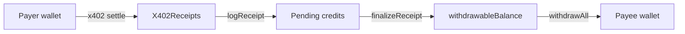

# pharos-x402-paywall

Monetize agent outputs with **x402 micropayments** on Pharos — paywall server, autopay client, self-hosted facilitator, and on-chain `X402Receipts` ledger with dispute windows, `forceFinalize`, and `getEarningsSummary` dashboards.

Atlantic uses **repo-deployed MockUSDC** (EIP-3009) — Circle USDC is not available on testnet. Address in [`assets/tokens.json`](assets/tokens.json); deploy/mint: [`references/mock-usdc.md`](references/mock-usdc.md).

## Judge Quick Path (< 5 min)

```bash
git clone https://github.com/dev8555/pharos-x402-paywall && cd pharos-x402-paywall
npm install && cp .env.example .env   # set EVM_PRIVATE_KEY
forge install foundry-rs/forge-std
npm run facilitator   # terminal 1
npm run server        # terminal 2
curl -i http://localhost:4021/insight          # expect 402
npm run client -- http://localhost:4021/insight  # expect 200 + tx hash
npm run dashboard -- 0x73c37e8eddD9beF70FBbbe2861a8A776FABf1AA7
```

Expected dashboard:

```
Lifetime: $0.01 USDC
Pending: $0.01
Withdrawable: $0.00
Total payments: 1
```

Full checklist: [JUDGE.md](JUDGE.md)

## Live Proofs

| Proof | Link |
|-------|------|
| MockUSDC deploy tx | [0x33c31356…f5ba](https://atlantic.pharosscan.xyz/tx/0x33c313567c8820f2b33378a83372cd068a5469db72b1bf1a522dfe88d4d5f5ba) |
| MockUSDC (EIP-3009) | [0xeAeb…B618](https://atlantic.pharosscan.xyz/address/0xeAeb66E869C43FB5FeB0A18729A2fbaAEB30B618) |
| Deploy tx (v1.1 receipts) | [0xc6cd6883…018e5](https://atlantic.pharosscan.xyz/tx/0xc6cd6883f3a3890379d8c6adfc491340baddc576aeef75d4d0337bae0d7018e5) |
| Contract (v1.1 auth) | [0xB9b9…2160](https://atlantic.pharosscan.xyz/address/0xB9b98cC2cCF067F710A7DCc92d8FC558F5b12160) |
| Contract (v1.0 legacy) | [0xE0d0…5466](https://atlantic.pharosscan.xyz/address/0xE0d0FCb866e02435A116ff62dD6caBb341b95466) |
| Sample paid tx | [0x69eecaf5…c359](https://atlantic.pharosscan.xyz/tx/0x69eecaf58d7686884aa4dbfe30a0f162ab815ab61a2c6ade14627fed22b6c359) |
| Sample ReceiptLogged | `cast logs --rpc-url https://atlantic.dplabs-internal.com --address 0xB9b98cC2cCF067F710A7DCc92d8FC558F5b12160 --from-block 24408894 'ReceiptLogged(uint256,address,address,address,uint256,bytes32,bytes32)'` |
| Dashboard sample | [docs/proofs/dashboard-sample.txt](docs/proofs/dashboard-sample.txt) |

> **v1.1 contract** at `0xB9b98cC2cCF067F710A7DCc92d8FC558F5b12160` includes authorized `logReceipt`, facilitator signer, and EIP-712 proof paths.

## Quick Start

```bash
npm install
cp .env.example .env
forge install foundry-rs/forge-std
forge test -vv
npm run test:all
npm run facilitator
npm run server
curl -i http://localhost:4021/insight
npm run client -- http://localhost:4021/insight
```

## Architecture

See [docs/ARCHITECTURE.md](docs/ARCHITECTURE.md) for system diagram, payment flow, and receipt lifecycle.

## Security

See [docs/SECURITY.md](docs/SECURITY.md) — custody, dispute assumptions, trusted roles, limitations.

## MCP & Agent CLI

- **MCP server:** `npm run mcp` — see [docs/MCP.md](docs/MCP.md)
- **Agent CLI:** `npm run agent -- health|probe|earnings|receipt`
- **Agent skill:** [SKILL.md](SKILL.md)

## Treasury Wiring



Set `PAY_TO_ADDRESS` = deployed `X402Receipts` address. USDC settles to the contract; `logReceipt` credits `PAYEE_ADDRESS`.

## Deploy Contract (Atlantic)

```bash
export PRIVATE_KEY=0x...
export RPC=https://atlantic.dplabs-internal.com
export DISPUTE_WINDOW_SECONDS=300
export RECORDER_ADDRESS=0x...      # paywall operator wallet
export FACILITATOR_SIGNER_ADDRESS=0x...  # facilitator signer
forge script script/DeployX402Receipts.s.sol:DeployX402Receipts \
  --rpc-url $RPC --private-key $PRIVATE_KEY --broadcast
```

Update `RECEIPTS_ADDRESS`, `PAY_TO_ADDRESS` in `.env`. Verify: [references/receipts.md](references/receipts.md#verify)

## Atlantic Deployment

| Contract | Address | Explorer |
|----------|---------|----------|
| X402Receipts (v1.1) | `0xB9b98cC2cCF067F710A7DCc92d8FC558F5b12160` | [view](https://atlantic.pharosscan.xyz/address/0xB9b98cC2cCF067F710A7DCc92d8FC558F5b12160) |
| X402Receipts (v1.0 legacy) | `0xE0d0FCb866e02435A116ff62dD6caBb341b95466` | [view](https://atlantic.pharosscan.xyz/address/0xE0d0FCb866e02435A116ff62dD6caBb341b95466) |

**Payee wallet:** `0x73c37e8eddD9beF70FBbbe2861a8A776FABf1AA7`

## Example Agent Prompts

1. **Deploy receipts with auth** → `references/receipts.md#deploy`
2. **Put a $0.01 paywall on /insight** → facilitator + server
3. **Pay for /insight** → `npm run client`
4. **Show earnings** → `npm run dashboard` or MCP `get_earnings`
5. **Finalize and withdraw** → `finalizeReceipt` + `withdrawAll`

## Phase 2: Insight Vendor Agent

Autonomous earnings monitor: [examples/insight-vendor-agent/](examples/insight-vendor-agent/)

## Project Structure

- [`SKILL.md`](SKILL.md) — agent entry point
- [`docs/`](docs/) — architecture, security, MCP
- [`references/`](references/) — command specs
- [`src/`](src/) — facilitator, server, client, MCP
- [`contracts/X402Receipts.sol`](contracts/X402Receipts.sol) — on-chain ledger (v1.1 auth)

## License

MIT
