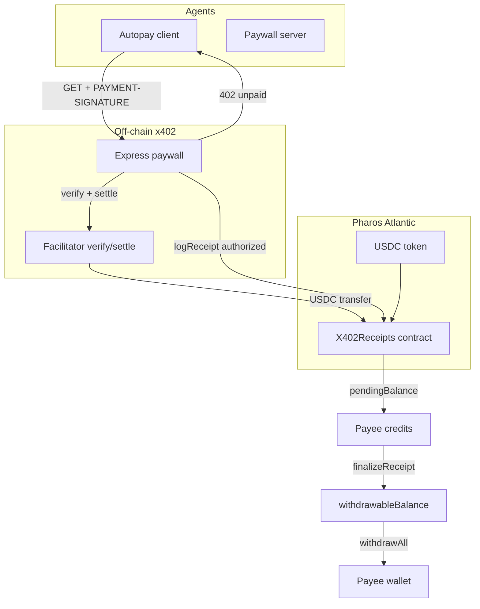
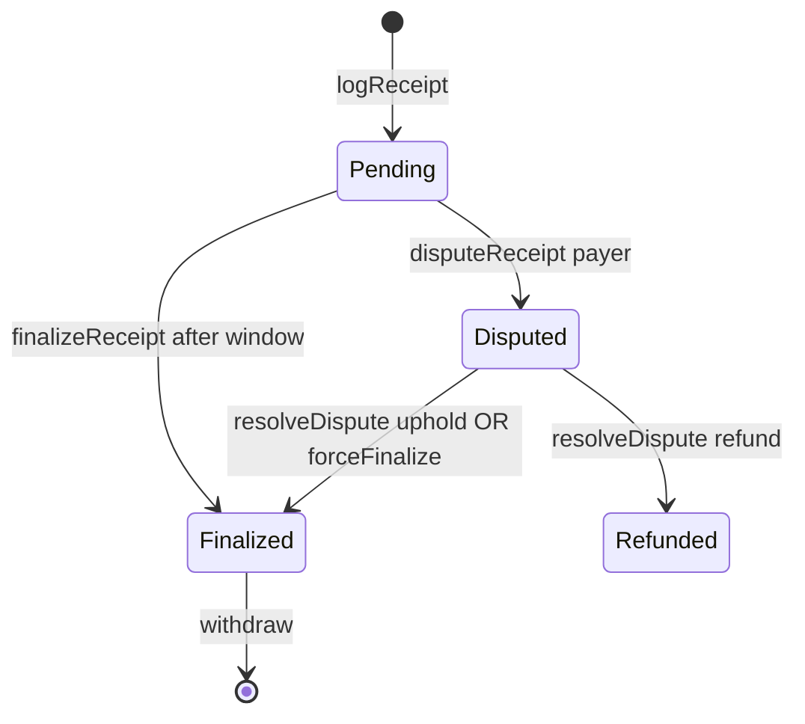

# Architecture

pharos-x402-paywall connects HTTP 402 micropayments, a self-hosted facilitator, and an on-chain USDC receipt ledger on Pharos Atlantic.

## System diagram

## Payment flow

1. Client requests a paid route → **402 Payment Required**
2. Client signs x402 payload and retries with **PAYMENT-SIGNATURE**
3. Paywall calls facilitator **verify** then **settle**
4. Facilitator submits USDC transfer to treasury (`PAY_TO_ADDRESS` = `X402Receipts`)
5. Paywall `onAfterSettle` calls **`logReceipt`** (authorized recorder wallet)
6. Receipt enters **Pending**; dispute window starts
7. After window: **finalizeReceipt** → **withdrawAll**

## Authorization model (v1.1+)

`logReceipt` accepts callers via **any one** of:

| Path | Who |
|------|-----|
| `authorizedRecorders[msg.sender]` | Paywall operator wallet (set at deploy) |
| `msg.sender == facilitatorSigner` | Facilitator hot wallet |
| `logReceiptWithProof(..., signature)` | Anyone with valid facilitator EIP-712 attestation |

See [SECURITY.md](SECURITY.md) for trust assumptions.

## Receipt lifecycle

## Key files

| Layer | Path |
|-------|------|
| Contract | `contracts/X402Receipts.sol` |
| Paywall | `src/paywallApp.ts`, `src/server.ts` |
| Facilitator | `src/facilitator.ts` |
| Autopay | `src/client.ts` |
| Receipt helper | `src/receipts.ts` |
| MCP tools | `src/mcp/server.ts` |
| Agent CLI | `src/agent-cli.ts` |
