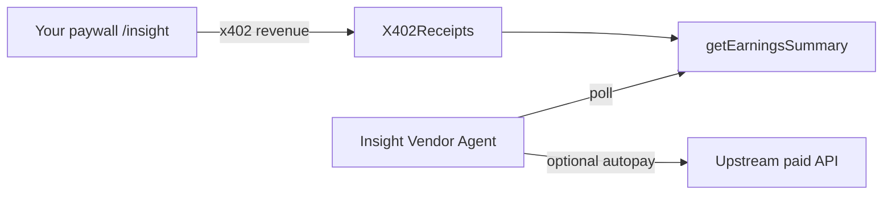

# Insight Vendor Agent (Phase 2)

Autonomous mini-agent that composes the [pharos-x402-paywall SKILL](../../SKILL.md): poll earnings, optionally pay upstream APIs, and log revenue deltas.

## Setup

```bash
cp .env.example .env
# EVM_PRIVATE_KEY, RECEIPTS_ADDRESS, PAYEE_ADDRESS from repo root .env
```

## Run

From repo root (with facilitator + paywall already running):

```bash
npx tsx examples/insight-vendor-agent/agent.ts
```

## Behavior

1. Polls `getEarningsSummary` every `POLL_INTERVAL_MS` (default 60s)
2. Logs lifetime/pending/withdrawable deltas
3. Optionally fetches upstream data via autopay (`UPSTREAM_URL`) when configured

## Agent prompt (Cursor)

> Load SKILL.md. Start facilitator and paywall. Run the Insight Vendor Agent example to monitor earnings while selling /insight at $0.01. Use MCP tools `get_earnings` and `paywall_probe` to verify health.

## Architecture



See [docs/ARCHITECTURE.md](../../docs/ARCHITECTURE.md) and [examples/agent-sells-insight/README.md](../agent-sells-insight/README.md).
