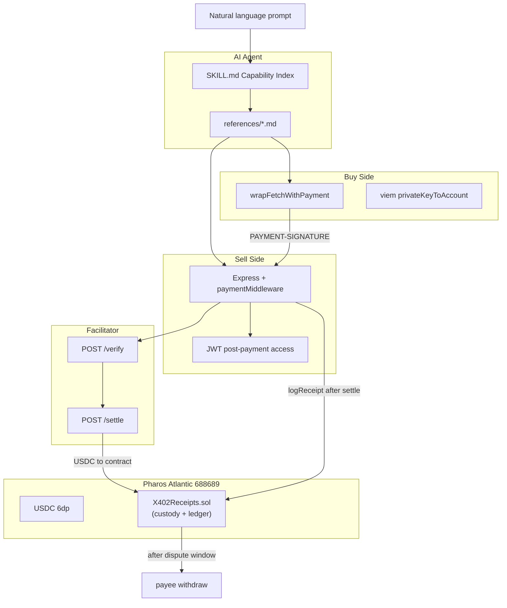
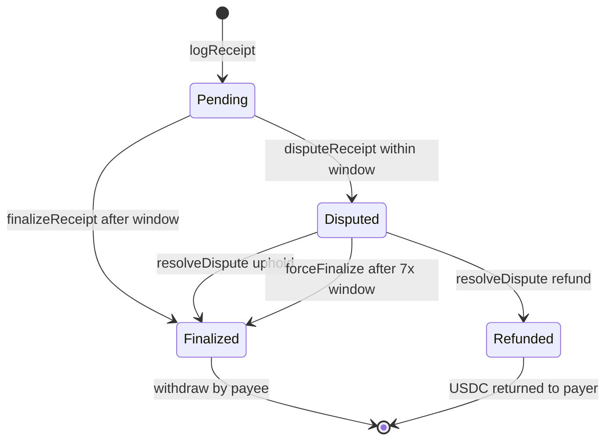

# pharos-x402-paywall — Phase 1 Skill Build Plan

> **Skill name:** `pharos-x402-paywall`  
> **Tagline:** The cash register + wallet for the agent economy — monetize any endpoint with x402 USDC micropayments on Pharos, autonomously pay 402-protected APIs, and log auditable on-chain receipts.  
> **Target:** Pharos Skill-to-Agent Hackathon, Phase 1 (Skill)  
> **Deadline:** June 17, 2026 (extended)  
> **Format:** Standalone repo, Pharos Skill Engine layout + agentskills.io-compliant `SKILL.md`  
> **Starting state:** Empty directory (`d:\pharos_4`)

---

## 1. What we're building (and why it wins)

x402 is Pharos's flagship primitive for the Autonomous Economy: HTTP `402 Payment Required` reactivated as a trustless, pay-per-call money rail. Most hackathon teams will ship generic token/airdrop tools. **`pharos-x402-paywall` ships the money layer every Phase 2 agent needs** — both sides of it, plus on-chain proof.

| Capability | What the agent can do |
|---|---|
| **Sell side (paywall)** | Scaffold an Express server with `@x402/express` middleware; charge USDC per route on `eip155:688689` |
| **Buy side (autopay)** | Wrap `fetch` with `@x402/fetch`; detect 402, sign payment, retry, return content + `tx_hash` |
| **Settlement** | Run or connect to a Facilitator (`/verify`, `/settle`, `/supported`) |
| **Proof layer** | Deploy `X402Receipts.sol` — receipt ledger with **dispute window**, **payee withdrawal aggregation**, and **resource-level revenue analytics** |
| **Treasury mode** | Route x402 `payTo` through the contract so USDC accumulates on-chain; payees `withdraw()` after dispute window closes |

**Differentiator vs official [`x402-pharos`](https://github.com/PharosNetwork/examples/tree/main/skills/x402-pharos) example skill:** Full Skill Engine packaging (Capability Index, 4 reference files, write pre-checks), **sophisticated on-chain settlement ledger** (not a 40-line event logger), JWT post-payment access, idempotency/retry guidance, and A2A demo narrative for Phase 2.

**Judging leverage:**

| Criterion | Score rationale |
|---|---|
| Originality | x402 + custody ledger with disputes, withdrawals, and per-route analytics is uncommon |
| Practical use | Every monetized agent needs sell + buy + settle |
| Reusability | Composes with analyst, compliance, payments, RWA skills in Phase 2 |
| Pharos integration | USDC on Atlantic, sub-second finality, official x402 SDK patterns |
| Vision | Literal revenue engine for Anvita Flow agents |

---

## 2. Architecture



### x402 pay-before-receive loop (per [Pharos x402 docs](https://docs.pharos.xyz/developer-guide/x402))

1. Client `GET /insight` → server returns **402** + Base64 `PaymentRequired` in **`PAYMENT-REQUIRED`** header.
2. Client builds + signs `PaymentPayload`, re-requests with **`PAYMENT-SIGNATURE`** header.
3. Server (via Facilitator) **`POST /verify`** → on success, server does work, **`POST /settle`** broadcasts USDC transfer **to `X402Receipts` contract** (`payTo` = contract address).
4. Server returns **200** + content + Base64 settlement in **`PAYMENT-RESPONSE`** (includes `tx_hash`).
5. **Our addition:** server calls `X402Receipts.logReceipt(...)` → receipt enters **Pending** state; payer dispute window starts; **resource analytics** updated.
6. **After dispute window:** anyone calls `finalizeReceipt(id)` → amount moves to payee **withdrawable balance**; payee calls `withdraw(asset, amount)`.

### Receipt lifecycle (on-chain state machine)



---

## 3. Repository structure (greenfield)

```
pharos-x402-paywall/
├── SKILL.md                          # Agent entry: frontmatter + Capability Index + pre-checks
├── README.md                         # Human onboarding, demo prompts, deployed addresses, explorer links
├── LICENSE                             # MIT
├── .env.example                        # PRIVATE_KEY, PAY_TO_ADDRESS (=RECEIPTS), PAYEE_ADDRESS, FACILITATOR_URL, USDC_ADDRESS, RPC, RECEIPTS_ADDRESS, DISPUTE_WINDOW_SECONDS
├── .gitignore                          # .env, .private_key, node_modules/, cache/, out/
│
├── assets/
│   ├── networks.json                   # Atlantic + Pacific: rpc, chainId, explorer, verifier URLs
│   ├── tokens.json                     # USDC addresses + decimals per network
│   ├── x402/
│   │   ├── X402Receipts.sol            # Source-of-truth template (agent copies to user project)
│   │   └── DeployX402Receipts.s.sol    # Forge deploy script template
│   └── templates/
│       ├── server.ts.tpl               # x402 Express paywall (parametrized routes + prices)
│       ├── client.ts.tpl               # x402 autopay fetch client
│       ├── facilitator.ts.tpl          # Self-hosted facilitator
│       ├── receipts.ts.tpl             # logReceipt helper after settle
│       └── env.tpl                     # .env scaffold
│
├── references/                         # Skill Engine reference files (one section per operation)
│   ├── paywall.md                      # SELL: scaffold server, pricing, JWT, test with curl
│   ├── autopay.md                      # BUY: wrapped fetch, sign, retry, idempotency
│   ├── facilitator.md                  # Run/connect facilitator, health, troubleshooting
│   └── receipts.md                     # Deploy/verify X402Receipts + cast call/logs
│
├── src/                                # Runnable reference implementation (copy of templates, filled)
│   ├── server.ts
│   ├── client.ts
│   ├── facilitator.ts
│   └── receipts.ts                     # viem writeContract logReceipt + decode PAYMENT-RESPONSE
│
├── contracts/                          # Foundry mirror (same as assets/x402/)
│   └── X402Receipts.sol
├── script/
│   └── DeployX402Receipts.s.sol
├── test/
│   └── X402Receipts.t.sol
├── foundry.toml
├── package.json                        # @x402/*, express, viem, dotenv, jsonwebtoken, typescript
├── tsconfig.json
└── examples/
    ├── agent-sells-insight/README.md
    ├── agent-pays-agent/README.md      # A2A demo for Phase 2 narrative
    └── pay-per-llm-call/README.md
```

**Convention:** Contract in both `assets/x402/` (agent template) and `contracts/`/`src/` (Foundry). TypeScript reference impl in `src/` mirrors filled templates.

---

## 4. Component specifications

### 4.1 `X402Receipts.sol` — build FIRST (Skill Engine Stage 1)

**Design goal:** Move beyond a 40-line event logger. The contract is a **USDC custody ledger** that x402 settlements flow into, with dispute protection, aggregated payee withdrawals, and per-resource revenue analytics — the on-chain "settlement layer" judges expect for a payments Skill.

**Treasury mode (required for demo):** Set `PAY_TO_ADDRESS` = deployed `X402Receipts` address. x402 settle sends USDC to the contract; `logReceipt` allocates credits to the logical payee (agent wallet). Payees withdraw after the dispute window.

Contract is source of truth: every public function → Capability Index row + `references/receipts.md` section.

#### State model

| Concept | Storage | Purpose |
|---|---|---|
| Receipt lifecycle | `enum ReceiptStatus { Pending, Disputed, Finalized, Refunded }` | Dispute window + resolution |
| Pending credits | `pendingBalance[payee][asset]` | Locked until window closes or dispute resolved |
| Disputed credits | `disputedBalance[payee][asset]` | Locked in dispute; released on resolve or forceFinalize |
| Withdrawable | `withdrawableBalance[payee][asset]` | Payee can `withdraw()` |
| Lifetime earned | `lifetimeRevenue[payee][asset]` | Monotonic total for `getEarningsSummary` |
| Force-finalize timeout | `disputeWindowSeconds * 7` | Anyone can `forceFinalize` disputed receipt — no owner needed |
| Agent dashboard | `getEarningsSummary(payee, asset)` | Single view: lifetime, pending, withdrawable, disputed, payment count |
| Global analytics | `resourceStats[resourceId]` | `totalRevenue`, `paymentCount`, `lastPaymentAt` |
| Payee × resource | `payeeResourceStats[payee][resourceId]` | Per-route earnings for agent dashboards |
| Dispute window | `disputeWindowSeconds` (constructor, default `3600` demo / `86400` prod) | Configurable by owner |
| Idempotency | `usedSettleTx[bytes32]` | Prevent double-credit from same settlement tx |

#### Full contract sketch

```solidity
// SPDX-License-Identifier: MIT
pragma solidity ^0.8.20;

import {IERC20} from "@openzeppelin/contracts/token/ERC20/IERC20.sol";
import {SafeERC20} from "@openzeppelin/contracts/token/ERC20/utils/SafeERC20.sol";
import {Ownable} from "@openzeppelin/contracts/access/Ownable.sol";

contract X402Receipts is Ownable {
    using SafeERC20 for IERC20;

    enum ReceiptStatus { Pending, Disputed, Finalized, Refunded }

    struct Receipt {
        address payer;
        address payee;
        address asset;
        uint256 amount;
        bytes32 resourceId;
        bytes32 settleTxHash;
        uint256 loggedAt;
        ReceiptStatus status;
    }

    struct ResourceAnalytics {
        uint256 totalRevenue;
        uint256 paymentCount;
        uint256 lastPaymentAt;
    }

    uint256 public receiptCount;
    uint256 public disputeWindowSeconds;

    mapping(uint256 => Receipt) public receipts;
    mapping(address => uint256[]) public receiptsByPayee;
    mapping(address => mapping(address => uint256)) public pendingBalance;
    mapping(address => mapping(address => uint256)) public disputedBalance;
    mapping(address => mapping(address => uint256)) public withdrawableBalance;
    mapping(address => mapping(address => uint256)) public lifetimeRevenue;
    uint256 public constant FORCE_FINALIZE_MULTIPLIER = 7;
    mapping(bytes32 => ResourceAnalytics) public resourceStats;
    mapping(address => mapping(bytes32 => ResourceAnalytics)) public payeeResourceStats;
    mapping(bytes32 => bool) public usedSettleTx;

    event ReceiptLogged(uint256 indexed id, address indexed payer, address indexed payee,
        address asset, uint256 amount, bytes32 resourceId, bytes32 settleTxHash);
    event ReceiptDisputed(uint256 indexed id, address indexed payer, string reason);
    event ReceiptFinalized(uint256 indexed id, address indexed payee, uint256 amount);
    event ReceiptRefunded(uint256 indexed id, address indexed payer, uint256 amount);
    event Withdrawn(address indexed payee, address indexed asset, uint256 amount, address indexed to);
    event DisputeWindowUpdated(uint256 oldWindow, uint256 newWindow);

    constructor(uint256 _disputeWindowSeconds) Ownable(msg.sender) {
        require(_disputeWindowSeconds > 0, "invalid dispute window");
        disputeWindowSeconds = _disputeWindowSeconds;
    }

    // --- Core: log settlement (called by paywall server after x402 settle) ---
    function logReceipt(
        address payer,
        address payee,
        address asset,
        uint256 amount,
        bytes32 resourceId,
        bytes32 settleTxHash
    ) external returns (uint256 id) {
        require(payee != address(0), "payee required");
        require(amount > 0, "amount must be > 0");
        require(!usedSettleTx[settleTxHash], "settle tx already used");
        usedSettleTx[settleTxHash] = true;

        id = receiptCount++;
        receipts[id] = Receipt({
            payer: payer, payee: payee, asset: asset, amount: amount,
            resourceId: resourceId, settleTxHash: settleTxHash,
            loggedAt: block.timestamp, status: ReceiptStatus.Pending
        });
        receiptsByPayee[payee].push(id);
        pendingBalance[payee][asset] += amount;
        lifetimeRevenue[payee][asset] += amount;

        _updateAnalytics(payee, resourceId, amount);
        emit ReceiptLogged(id, payer, payee, asset, amount, resourceId, settleTxHash);
    }

    // --- Dispute window ---
    function disputeReceipt(uint256 id, string calldata reason) external {
        Receipt storage r = receipts[id];
        require(r.status == ReceiptStatus.Pending, "not pending");
        require(msg.sender == r.payer, "not payer");
        require(block.timestamp < r.loggedAt + disputeWindowSeconds, "dispute window closed");
        r.status = ReceiptStatus.Disputed;
        pendingBalance[r.payee][r.asset] -= r.amount;
        disputedBalance[r.payee][r.asset] += r.amount;
        emit ReceiptDisputed(id, msg.sender, reason);
    }

    function finalizeReceipt(uint256 id) external {
        Receipt storage r = receipts[id];
        require(r.status == ReceiptStatus.Pending, "not pending");
        require(block.timestamp >= r.loggedAt + disputeWindowSeconds, "dispute window open");
        r.status = ReceiptStatus.Finalized;
        pendingBalance[r.payee][r.asset] -= r.amount;
        withdrawableBalance[r.payee][r.asset] += r.amount;
        emit ReceiptFinalized(id, r.payee, r.amount);
    }

    function resolveDispute(uint256 id, bool refundToPayer) external onlyOwner {
        Receipt storage r = receipts[id];
        require(r.status == ReceiptStatus.Disputed, "not disputed");
        disputedBalance[r.payee][r.asset] -= r.amount;
        if (refundToPayer) {
            r.status = ReceiptStatus.Refunded;
            lifetimeRevenue[r.payee][r.asset] -= r.amount;
            _updateAnalytics(r.payee, r.resourceId, r.amount, true);
            IERC20(r.asset).safeTransfer(r.payer, r.amount);
            emit ReceiptRefunded(id, r.payer, r.amount);
        } else {
            r.status = ReceiptStatus.Finalized;
            withdrawableBalance[r.payee][r.asset] += r.amount;
            emit ReceiptFinalized(id, r.payee, r.amount);
        }
    }

    /// @notice Permissionless escape hatch — if owner never resolves, payee gets funds after 7x dispute window
    function forceFinalize(uint256 id) external {
        Receipt storage r = receipts[id];
        require(r.status == ReceiptStatus.Disputed, "not disputed");
        require(
            block.timestamp >= r.loggedAt + disputeWindowSeconds * FORCE_FINALIZE_MULTIPLIER,
            "force finalize too early"
        );
        r.status = ReceiptStatus.Finalized;
        disputedBalance[r.payee][r.asset] -= r.amount;
        withdrawableBalance[r.payee][r.asset] += r.amount;
        emit ReceiptFinalized(id, r.payee, r.amount);
    }

    // --- Payee withdrawal aggregation ---
    function withdraw(address asset, uint256 amount, address to) external {
        require(to != address(0), "zero recipient");
        uint256 bal = withdrawableBalance[msg.sender][asset];
        require(bal >= amount, "insufficient withdrawable");
        withdrawableBalance[msg.sender][asset] = bal - amount;
        IERC20(asset).safeTransfer(to, amount);
        emit Withdrawn(msg.sender, asset, amount, to);
    }

    function withdrawAll(address asset, address to) external {
        uint256 bal = withdrawableBalance[msg.sender][asset];
        require(bal > 0, "nothing to withdraw");
        withdrawableBalance[msg.sender][asset] = 0;
        IERC20(asset).safeTransfer(to, bal);
        emit Withdrawn(msg.sender, asset, bal, to);
    }

    // --- Resource-level revenue analytics (views) ---
    function getResourceRevenue(bytes32 resourceId) external view returns (
        uint256 totalRevenue, uint256 paymentCount, uint256 lastPaymentAt
    ) {
        ResourceAnalytics memory s = resourceStats[resourceId];
        return (s.totalRevenue, s.paymentCount, s.lastPaymentAt);
    }

    function getPayeeResourceStats(address payee, bytes32 resourceId) external view returns (
        uint256 totalRevenue, uint256 paymentCount, uint256 lastPaymentAt
    ) {
        ResourceAnalytics memory s = payeeResourceStats[payee][resourceId];
        return (s.totalRevenue, s.paymentCount, s.lastPaymentAt);
    }

    function getReceipt(uint256 id) external view returns (Receipt memory) {
        return receipts[id];
    }

    function payeeReceiptCount(address payee) external view returns (uint256) {
        return receiptsByPayee[payee].length;
    }

    /// @notice Single-call agent dashboard — demo closing beat
    function getEarningsSummary(address payee, address asset) external view returns (
        uint256 lifetimeEarned,
        uint256 pending,
        uint256 withdrawable,
        uint256 disputed,
        uint256 paymentCount
    ) {
        return (
            lifetimeRevenue[payee][asset],
            pendingBalance[payee][asset],
            withdrawableBalance[payee][asset],
            disputedBalance[payee][asset],
            receiptsByPayee[payee].length
        );
    }

    function setDisputeWindow(uint256 newWindow) external onlyOwner {
        require(newWindow > 0, "invalid dispute window");
        emit DisputeWindowUpdated(disputeWindowSeconds, newWindow);
        disputeWindowSeconds = newWindow;
    }

    function _updateAnalytics(address payee, bytes32 resourceId, uint256 amount, bool decrement) internal {
        _bumpStats(resourceStats[resourceId], amount, decrement);
        _bumpStats(payeeResourceStats[payee][resourceId], amount, decrement);
    }

    function _updateAnalytics(address payee, bytes32 resourceId, uint256 amount) internal {
        _updateAnalytics(payee, resourceId, amount, false);
    }

    function _bumpStats(ResourceAnalytics storage s, uint256 amount, bool decrement) private {
        if (decrement) {
            s.totalRevenue -= amount;
            s.paymentCount -= 1;
        } else {
            s.totalRevenue += amount;
            s.paymentCount += 1;
            s.lastPaymentAt = block.timestamp;
        }
    }
}
```

#### Exact revert strings (must match reference error tables)

`"payee required"`, `"amount must be > 0"`, `"settle tx already used"`, `"not pending"`, `"not payer"`, `"dispute window closed"`, `"dispute window open"`, `"not disputed"`, `"force finalize too early"`, `"insufficient withdrawable"`, `"nothing to withdraw"`, `"zero recipient"`, `"invalid dispute window"`, `"Not owner"`

#### Integration with paywall server

1. Deploy `X402Receipts` with `disputeWindowSeconds` (use `300` for demo so finalize can be shown quickly).
2. Set `PAY_TO_ADDRESS` = `X402Receipts` contract address in server `.env`.
3. After x402 settle succeeds, `receipts.ts` calls `logReceipt(payer, payee, usdc, amount, resourceId, settleTxHash)`.
4. `payee` = agent's withdrawal wallet (may differ from contract address).
5. `settleTxHash` = `bytes32` from decoded `PAYMENT-RESPONSE` transaction hash (idempotency key).

#### Demo-friendly dispute window

For the live demo, use **`disputeWindowSeconds = 300`** (5 min) or provide a `finalizeReceipt` call after fast-forward/wait. Document both short demo window and production `86400` (24h) in README.

#### OpenZeppelin deps

`forge install OpenZeppelin/openzeppelin-contracts` — use `SafeERC20`, `Ownable`.

#### Judge-facing feature map

| Your requirement | On-chain implementation | Demo moment |
|---|---|---|
| **Receipt dispute window** | `Pending` → payer `disputeReceipt` within window; owner `resolveDispute` (optional); `forceFinalize` after 7× window — **no owner required** | Document permissionless escape hatch in references |
| **Payee withdrawal aggregation** | USDC settles to contract (`payTo`); credits accumulate in `withdrawableBalance`; `withdraw` / `withdrawAll` | `withdrawAll` at end of demo — agent treasury sweep |
| **Agent earnings dashboard** | `getEarningsSummary(payee, asset)` — lifetime, pending, withdrawable, disputed, payment count in one call | **Demo closing beat** — agent reads human-readable summary, not raw tuple dumps |
| **Resource-level revenue analytics** | `resourceStats` + `payeeResourceStats`; `getResourceRevenue` / `getPayeeResourceStats` for per-route drill-down | Optional second `cast call` for `/insight` route detail |

### 4.2 Sell side — x402 paywall server

**Packages:** `@x402/express`, `@x402/evm/exact/server`, `@x402/core/server`, `express`, `dotenv`, `jsonwebtoken`

**Core pattern** (mirror [Pharos x402 docs](https://docs.pharos.xyz/developer-guide/x402) exactly):

```typescript
import { paymentMiddleware, x402ResourceServer } from "@x402/express";
import { ExactEvmScheme } from "@x402/evm/exact/server";
import { HTTPFacilitatorClient } from "@x402/core/server";

const facilitatorClient = new HTTPFacilitatorClient({ url: facilitatorUrl });
const resourceServer = new x402ResourceServer(facilitatorClient);
const evmScheme = new ExactEvmScheme();

evmScheme.registerMoneyParser(async (amount, network) => {
  if (network === "eip155:688689") {
    return {
      amount: Math.round(amount * 1e6).toString(),
      asset: usdcAddress,
      extra: { token: "USDC", name: "USDC", version: "2" },
    };
  }
  return null;
});

resourceServer.register("eip155:688689", evmScheme);
```

**Route pricing (template defaults):**

| Route | Price | Notes |
|---|---|---|
| `GET /insight` | $0.01 | Primary demo endpoint |
| `GET /api/info` | $0.005 | Low-cost tier |
| `GET /health` | free | No middleware |

**JWT post-payment access** (Pharos dev recommendation):
- After successful payment verification, issue short-lived JWT (e.g. 5–15 min TTL).
- Optional `Authorization: Bearer <jwt>` bypasses re-payment for repeat calls within TTL.
- Document in `references/paywall.md#jwt` — not required for demo but strengthens submission.

**Receipt hook:** On settle success, call `receipts.logReceiptOnChain(...)` with `settleTxHash` for idempotency. **`PAY_TO_ADDRESS` must be the `X402Receipts` contract** so USDC custody + withdrawal aggregation work.

### 4.3 Buy side — autopay client

**Packages:** `@x402/fetch`, `@x402/evm/exact/client`, `viem`, `dotenv`

```typescript
import { wrapFetchWithPayment, x402Client, decodePaymentResponseHeader } from "@x402/fetch";
import { ExactEvmScheme } from "@x402/evm/exact/client";
import { privateKeyToAccount } from "viem/accounts";

const signer = privateKeyToAccount(privateKey);
const client = new x402Client();
client.register("eip155:688689", new ExactEvmScheme(signer));
const fetchWithPayment = wrapFetchWithPayment(fetch, client);
```

**Security:** Private key from `EVM_PRIVATE_KEY` env or `.private_key` file only — **never pass to the model** (document in SKILL.md Security Reminders).

**Idempotency + retry** (per Pharos dev recommendations):
- On network failure after settle, retry with same payment proof / tx hash.
- Server must not double-charge; document server-side idempotency key pattern in `references/autopay.md`.
- Parse `PAYMENT-RESPONSE` via `decodePaymentResponseHeader` → surface `transaction`, `network`, `payer`.

### 4.4 Facilitator — self-host option

**Packages:** `@x402/core/facilitator`, `@x402/evm`, `@x402/evm/exact/facilitator`, `viem`, `express`

**Pharos chain definition:**

```typescript
const pharos = defineChain({
  id: 688_689,
  name: "Pharos Atlantic Testnet",
  nativeCurrency: { name: "PHRS", symbol: "PHRS", decimals: 18 },
  rpcUrls: { default: { http: ["https://atlantic.dplabs-internal.com"] } },
  testnet: true,
});
```

**Endpoints:** `POST /verify`, `POST /settle`, `GET /supported`

**Facilitator wallet needs:** PHRS for gas + sufficient USDC flow understanding (facilitator submits settlement txs).

**Fallback:** Document connecting to a hosted facilitator URL via `FACILITATOR_URL` env; note SPOF + health-check advice in `references/facilitator.md`.

### 4.5 `assets/networks.json`

```json
{
  "atlantic": {
    "name": "Pharos Atlantic Testnet",
    "chainId": 688689,
    "x402NetworkId": "eip155:688689",
    "rpcUrl": "https://atlantic.dplabs-internal.com",
    "explorerUrl": "https://atlantic.pharosscan.xyz",
    "explorerApiUrl": "https://api.socialscan.io/pharos-atlantic-testnet/v1/explorer/command_api/contract",
    "nativeSymbol": "PHRS"
  },
  "pacific": {
    "name": "Pharos Pacific Mainnet",
    "chainId": 1672,
    "x402NetworkId": "eip155:1672",
    "rpcUrl": "https://rpc.pharos.xyz",
    "explorerUrl": "https://pharosscan.xyz",
    "nativeSymbol": "PHRS"
  }
}
```

### 4.6 `assets/tokens.json`

```json
{
  "atlantic": {
    "USDC": {
      "address": "0xE0BE08c77f415F577A1B3A9aD7a1Df1479564ec8",
      "decimals": 6,
      "note": "Testnet USDC — not official; read address from this file"
    }
  }
}
```

---

## 5. SKILL.md specification (Skill Engine Stage 3)

### Frontmatter (agentskills.io)

```yaml
---
name: pharos-x402-paywall
description: >
  Monetize agent outputs with x402 micropayments on Pharos and autonomously pay
  for x402-protected resources in USDC. Use when an agent needs to (1) charge
  per API/endpoint call, (2) pay another agent or paid API that returns HTTP 402,
  (3) run or connect to an x402 facilitator for verify/settle, or (4) deploy and
  manage on-chain payment receipts with dispute windows, aggregated withdrawals,
  and per-route revenue analytics. Pharos Atlantic testnet (688689).
license: MIT
---
```

### Required body sections (mirror Pharos Skill Engine)

1. **Prerequisites** — Node 20+, Foundry (`cast`/`forge`), `EVM_PRIVATE_KEY`, `PAY_TO_ADDRESS`, testnet PHRS + USDC
2. **Network Configuration** — read `assets/networks.json` + `assets/tokens.json`; x402 network id `eip155:688689`
3. **Write Operation Pre-checks** (4-step sequence):
   - `cast wallet address --private-key $PRIVATE_KEY` (or derive from `EVM_PRIVATE_KEY` via viem in TS ops)
   - Confirm network matches Atlantic
   - Balance check: PHRS for gas; USDC for payer client
   - For contract deploy: `cast balance` before `forge script`
4. **General Error Handling** — global CLI/HTTP errors table (from Skill Engine Part 5 + x402-specific)
5. **Security Reminders** — never hardcode keys; never send private key to LLM; `.env` in `.gitignore`
6. **Capability Index** — full table below

### Capability Index

| User Need | Capability | Detailed Instructions |
|---|---|---|
| Monetize my endpoint / charge per call / put a paywall on this | Scaffold x402 Express server + route pricing | → `references/paywall.md` |
| Test paywall returns 402 / curl without payment | `curl -i` unpaid request | → `references/paywall.md#test-402` |
| Issue JWT after payment for repeat access | JWT middleware | → `references/paywall.md#jwt` |
| Let my agent pay this paid API / auto-pay 402 / pay another agent | `wrapFetchWithPayment` client | → `references/autopay.md` |
| Retry failed payment without double-charging | Idempotency + tx hash retry | → `references/autopay.md#idempotency` |
| Run a payment verifier and settler / self-host facilitator | Express facilitator on port 3000 | → `references/facilitator.md` |
| Connect to hosted facilitator | Set `FACILITATOR_URL` | → `references/facilitator.md#hosted` |
| Deploy receipts contract / log payments on-chain | `forge script` deploy | → `references/receipts.md#deploy` |
| Verify receipts contract on explorer | `forge verify-contract` + `sleep 10` | → `references/receipts.md#verify` |
| Log a receipt after settlement | `cast send logReceipt` or viem | → `references/receipts.md#log` |
| Dispute a payment / challenge a receipt | `cast send disputeReceipt` | → `references/receipts.md#dispute` |
| Finalize receipt after dispute window | `cast send finalizeReceipt` | → `references/receipts.md#finalize` |
| Force-finalize stuck dispute / owner absent | `cast send forceFinalize` after 7× window | → `references/receipts.md#force-finalize` |
| Resolve dispute (owner, optional) | `cast send resolveDispute` | → `references/receipts.md#resolve` |
| Show my earnings dashboard / AUM summary | `cast call getEarningsSummary` | → `references/receipts.md#earnings-summary` |
| Withdraw my aggregated earnings / sweep USDC | `cast send withdraw` or `withdrawAll` | → `references/receipts.md#withdraw` |
| Show revenue per endpoint / route analytics | `cast call getResourceRevenue` | → `references/receipts.md#analytics` |
| Show my earnings by route | `cast call getPayeeResourceStats` | → `references/receipts.md#analytics` |
| Show my earnings / list payments received | `cast logs ReceiptLogged` | → `references/receipts.md#query` |
| Read a receipt by ID | `cast call getReceipt` | → `references/receipts.md#read` |
| Check withdrawable balance | `cast call withdrawableBalance` | → `references/receipts.md#withdraw` |
| Check payer USDC balance before autopay | `cast call balanceOf` | → `references/autopay.md#precheck` |

---

## 6. Reference files (Skill Engine Stage 2)

Every section follows the **mandatory template**:

```
Overview → Command Template → Parameters → Output Parsing → Error Handling → Agent Guidelines
```

Header block on every file:

> **Network Configuration:** Read `rpcUrl` from `assets/networks.json` (default: Atlantic).  
> **x402 Network ID:** `eip155:688689`  
> **Private Key:** Pass explicitly via `--private-key $PRIVATE_KEY` (Foundry) or `EVM_PRIVATE_KEY` env (TypeScript). Foundry does NOT auto-read env vars.

### 6.1 `references/paywall.md`

| Section | Content |
|---|---|
| **Scaffold paywall server** | Copy `assets/templates/server.ts.tpl` → `server.ts`; fill `PAY_TO_ADDRESS`, `FACILITATOR_URL`, `USDC_ADDRESS`, route prices |
| **Start server** | `npx tsx src/server.ts` or `npm run server` |
| **Test 402** | `curl -i http://localhost:4021/insight` — expect `402` + `PAYMENT-REQUIRED` header |
| **Test paid access** | Run autopay client against same URL |
| **JWT (optional)** | Issue token after verify; document `Authorization` header bypass |
| **Wire receipt logging** | Import `receipts.ts`; call after settle |

**Error handling highlights:**

| Error | Cause | Fix |
|---|---|---|
| `402` on every request | Payment not attached | Use autopay client or manual `PAYMENT-SIGNATURE` |
| `Please set PAY_TO_ADDRESS` | Missing env | Export `PAY_TO_ADDRESS=0x...` |
| Facilitator connection refused | Wrong `FACILITATOR_URL` | Start facilitator first or fix URL |
| `insufficient funds` | Payer low on USDC | Fund wallet; check `balanceOf` |

### 6.2 `references/autopay.md`

| Section | Content |
|---|---|
| **Run autopay client** | `npx tsx src/client.ts http://localhost:4021/insight` |
| **Precheck USDC balance** | `cast call $USDC "balanceOf(address)(uint256)" $PAYER --rpc-url $RPC` |
| **Decode settlement** | `decodePaymentResponseHeader` → `transaction`, `payer`, `network` |
| **Idempotency** | Retry with same tx proof; server dedupes by tx hash |

### 6.3 `references/facilitator.md`

| Section | Content |
|---|---|
| **Start self-hosted facilitator** | `npx tsx src/facilitator.ts`; default port 3000 |
| **Health check** | `curl http://localhost:3000/supported` |
| **Hosted fallback** | Set `FACILITATOR_URL` to team-provided URL if available |
| **Troubleshooting** | Facilitator needs PHRS gas; RPC timeout → increase viem timeout to 30s |

### 6.4 `references/receipts.md`

| Section | Content |
|---|---|
| **Deploy X402Receipts** | `forge script` with constructor `disputeWindowSeconds` (e.g. `3600`); record address → set as `PAY_TO_ADDRESS` |
| **Verify** | `sleep 10` then `forge verify-contract` with `--constructor-args $(cast abi-encode "constructor(uint256)" 3600)` |
| **Log receipt** | `cast send $RECEIPTS "logReceipt(address,address,address,uint256,bytes32,bytes32)" payer payee asset amount resourceId settleTxHash` |
| **Dispute receipt** | `cast send $RECEIPTS "disputeReceipt(uint256,string)" <id> "reason"` — payer only, within window |
| **Finalize receipt** | `cast send $RECEIPTS "finalizeReceipt(uint256)" <id>` — after `disputeWindowSeconds` elapses |
| **Force-finalize dispute** | `cast send $RECEIPTS "forceFinalize(uint256)" <id>` — anyone, after `disputeWindowSeconds * 7`; upholds payee |
| **Resolve dispute (owner, optional)** | `cast send $RECEIPTS "resolveDispute(uint256,bool)" <id> true` — refund; `false` — uphold |
| **Earnings dashboard** | `cast call $RECEIPTS "getEarningsSummary(address,address)(uint256,uint256,uint256,uint256,uint256)" $PAYEE $USDC` |
| **Withdraw earnings** | `cast send $RECEIPTS "withdraw(address,uint256,address)" $USDC <amount> $PAYEE` |
| **Withdraw all** | `cast send $RECEIPTS "withdrawAll(address,address)" $USDC $PAYEE` |
| **Read receipt** | `cast call $RECEIPTS "getReceipt(uint256)(...)" <id> --rpc-url $RPC` |
| **Check balances** | `cast call $RECEIPTS "withdrawableBalance(address,address)(uint256)" $PAYEE $USDC` |
| **Resource analytics** | `cast call $RECEIPTS "getResourceRevenue(bytes32)(uint256,uint256,uint256)" $RESOURCE_ID` |
| **Payee route analytics** | `cast call $RECEIPTS "getPayeeResourceStats(address,bytes32)(uint256,uint256,uint256)" $PAYEE $RESOURCE_ID` |
| **Query earnings** | `cast logs` for `ReceiptLogged`, `ReceiptFinalized`, `Withdrawn` |

**resourceId encoding:** `cast keccak "GET /insight"` — must match server-side route hash.

**Agent guideline — treasury wiring:**
1. Deploy receipts contract first.
2. Set `PAY_TO_ADDRESS=<RECEIPTS_ADDRESS>` in server `.env` before starting paywall.
3. Set `PAYEE_ADDRESS` (logical agent wallet for withdrawals) separately from contract address.
4. After autopay demo, call `finalizeReceipt(0)` if dispute window not elapsed (or use 300s window for demo).
5. **Demo closing beat:** `getEarningsSummary($PAYEE, $USDC)` — agent parses output into readable dashboard (see Output Parsing table below).

**`getEarningsSummary` output parsing (agent formats for user):**

| Field | Raw value | Agent displays |
|---|---|---|
| `lifetimeEarned` | uint256 (6 dp) | "Lifetime: $X.XX USDC" — divide by 1e6 |
| `pending` | uint256 | "Pending (in dispute window): $X.XX" |
| `withdrawable` | uint256 | "Ready to withdraw: $X.XX" |
| `disputed` | uint256 | "In dispute: $X.XX" |
| `paymentCount` | uint256 | "Total payments: N" |

---

## 7. Foundry setup and tests

### `foundry.toml`

```toml
[profile.default]
src = "contracts"
out = "out"
libs = ["lib"]
solc = "0.8.20"
remappings = ["@openzeppelin/=lib/openzeppelin-contracts/"]
```

### Deploy script constructor

[`script/DeployX402Receipts.s.sol`](script/DeployX402Receipts.s.sol) passes `disputeWindowSeconds` from env (default `3600`). Log contract address and remind agent to set `PAY_TO_ADDRESS` to it.

### `test/X402Receipts.t.sol`

Use a mock ERC20 (6 decimals) minted to the contract to simulate x402 USDC inflows.

| Test | Assert |
|---|---|
| `logReceipt` happy path | `receiptCount` increments; `pendingBalance` credited; analytics bumped |
| `settle tx already used` | Second `logReceipt` with same `settleTxHash` reverts |
| `payee required` / `amount must be > 0` | Invalid inputs revert |
| `disputeReceipt` within window | Status → Disputed; `pendingBalance` decremented |
| `disputeReceipt` after window | Reverts `"dispute window closed"` |
| `disputeReceipt` not payer | Reverts `"not payer"` |
| `finalizeReceipt` after window | Status → Finalized; `withdrawableBalance` credited |
| `finalizeReceipt` during window | Reverts `"dispute window open"` |
| `resolveDispute` refund | Status → Refunded; USDC returned to payer; analytics decremented |
| `resolveDispute` uphold | Status → Finalized; `disputedBalance` cleared; `withdrawableBalance` credited |
| `forceFinalize` after 7× window | Disputed → Finalized without owner; payee credited |
| `forceFinalize` too early | Reverts `"force finalize too early"` |
| `getEarningsSummary` | Returns lifetime, pending, withdrawable, disputed, paymentCount |
| `withdraw` / `withdrawAll` | USDC transferred to payee; balance zeroed |
| `insufficient withdrawable` | Over-withdraw reverts |
| `getResourceRevenue` | Returns correct totals after multiple receipts |
| `getPayeeResourceStats` | Per-payee per-route isolation |
| `setDisputeWindow` | Owner-only; emits event |

Run: `forge test -vv`

---

## 8. Build phases and timeline

**Critical path:** Contract → Facilitator → Paywall → Autopay → E2E loop → Skill packaging → Demo

| Phase | Tasks | Output | Est. |
|---|---|---|---|
| **0. Setup** | `forge init`, `npm init`, pin `@x402/*` versions from Pharos docs, `.env.example`, `networks.json`, `tokens.json` | Skeleton compiles | 1–2h |
| **1. Contract** | Enhanced `X402Receipts.sol` (disputes + withdrawals + analytics), 15+ tests, deploy Atlantic, verify | Verified on pharosscan | 4–5h |
| **2. Facilitator** | `facilitator.ts` from docs; `GET /supported` works | Settlement service running | 2–3h |
| **3. Sell side** | `server.ts` paywall + receipt hook; curl → 402 | Paywall works | 3–4h |
| **4. Buy side** | `client.ts` autopay; E2E pay → 200 + tx_hash | Full money loop | 2–3h |
| **5. Skill packaging** | `SKILL.md` + 4 reference files + templates | Skill Engine compliant | 3–4h |
| **6. Examples + README** | 3 example walkthroughs; explorer links | Docs done | 2h |
| **7. Judge quick path** | A2A: agent sells → agent pays → receipt on explorer | JUDGE.md checklist | 2h |
| **8. Submit** | Public repo + DoraHacks | Submitted | 0.5h |

### Suggested 2-day schedule (from empty repo)

| Block | Focus | Exit criteria |
|---|---|---|
| **Day 1 AM** | Phase 0–1: setup + contract deploy/verify | Receipts contract on pharosscan |
| **Day 1 PM** | Phase 2–4: facilitator + paywall + client E2E | 402 → pay → 200 → USDC tx visible |
| **Day 2 AM** | Phase 5: SKILL.md + 4 reference files | Agent can scaffold from docs alone |
| **Day 2 PM** | Phase 6–8: examples, README, submit | DoraHacks submission live |

---

## 9. Judge quick path script

1. **Setup (10s):** `export EVM_PRIVATE_KEY`, deploy receipts contract; set `PAY_TO_ADDRESS` = contract.
2. **Start facilitator (15s):** Terminal 1 — facilitator on :3000; `curl /supported`.
3. **Monetize (40s):** Prompt agent → "$0.01 paywall on `/insight`." `curl -i` → **402**.
4. **Autopay (40s):** Autopay client → **200** + `tx_hash`; show USDC landed in receipts contract.
5. **Earnings dashboard (20s):** `cast call getEarningsSummary` — agent narrates: "Lifetime $0.01, 1 payment, $0.00 withdrawable (pending window)"
6. **Finalize + withdraw (30s):** `finalizeReceipt(0)` → `getEarningsSummary` again → `withdrawAll` → payee wallet USDC increases
7. **Composability (15s):** Phase 2 Insight Vendor Agent dashboard reads `getEarningsSummary` on schedule

---

## 10. `package.json` dependencies (pin early)

```json
{
  "dependencies": {
    "@x402/core": "latest",
    "@x402/evm": "latest",
    "@x402/express": "latest",
    "@x402/fetch": "latest",
    "dotenv": "^16.4.5",
    "express": "^4.21.0",
    "jsonwebtoken": "^9.0.2",
    "viem": "^2.21.0"
  },
  "devDependencies": {
    "@types/express": "^4.17.21",
    "@types/jsonwebtoken": "^9.0.7",
    "@types/node": "^20.0.0",
    "tsx": "^4.19.0",
    "typescript": "^5.6.0"
  },
  "scripts": {
    "facilitator": "tsx src/facilitator.ts",
    "server": "tsx src/server.ts",
    "client": "tsx src/client.ts",
    "build": "tsc --noEmit"
  }
}
```

**Phase 0 smoke test:** Install packages, copy Pharos doc snippets verbatim, confirm `npm run facilitator` + `npm run server` start without import errors before customizing.

---

## 11. Submission checklist

- [ ] `SKILL.md` frontmatter valid (lowercase-hyphenated `name`, trigger-rich `description`)
- [ ] Capability Index: natural phrasings + synonyms; every row → reference anchor
- [ ] 4 reference files complete (template, params, output parsing, error→fix, agent guidelines)
- [ ] `assets/networks.json` (688689 + 1672) and `tokens.json` (USDC, 6 dp)
- [ ] `X402Receipts.sol` compiles with OZ deps; **15+ Foundry tests** green; deployed + **verified** on Atlantic
- [ ] Treasury mode wired: `PAY_TO_ADDRESS` = receipts contract; USDC flows to contract on settle
- [ ] E2E loop: 402 → sign → verify → settle → 200 → `logReceipt` → analytics updated
- [ ] Withdrawal path demonstrated: `finalizeReceipt` → `withdraw` or `withdrawAll`
- [ ] Dispute path documented: `disputeReceipt` + `resolveDispute`
- [ ] Security: no hardcoded keys; idempotency documented; private key never to model
- [ ] README: what/why, install, 3 example prompts → on-chain results + explorer links
- [ ] Live proof links in README (deploy tx, contract, sample paid tx)
- [ ] Public repo pushed; DoraHacks submitted before **June 17**

---

## 12. Phase 2 extension (Agent Arena story)

**Insight Vendor Agent** on Anvita Flow:
- Reads market data via `pharos-onchain-analyst`
- Generates insight (LLM)
- **Sells** via `pharos-x402-paywall` (this Skill) — USDC per call
- **Pays** upstream premium data via autopay side (A2A)
- Treasury sweeps via `pharos-payments`

Phase 1 Skill = revenue engine of Phase 2 agent — clean Skill → Agent cascade.

---

## 13. Risks and mitigations

| Risk | Mitigation |
|---|---|
| `@x402/*` API drift | Pin versions; mirror Pharos docs verbatim in Phase 0; study official `x402-pharos` skill |
| Facilitator SPOF | Document self-host + hosted fallback; health-check `/supported` |
| Test USDC non-official | Read from `tokens.json`; warn in README |
| Verify fails after deploy | `sleep 10` in every deploy/verify guideline |
| Private key leakage | Env/file only; SKILL.md security section; `.gitignore` |
| Payer insufficient USDC | Precheck `balanceOf` in autopay.md |
| Receipt log fails but payment succeeded | Log receipt best-effort async; don't block 200; reconcile via `settleTxHash` idempotency |
| Payee withdraws before finalize | Document flow: must `finalizeReceipt` first; `withdrawableBalance` is 0 until then |
| Dispute window too long for demo | Use `300` seconds for demo deploy; document production `86400` |
| Contract holds USDC — security scrutiny | Use OZ `SafeERC20`; `onlyOwner` on `resolveDispute`; document audit scope as hackathon MVP |
| Analytics out of sync on refund | `_updateAnalytics` decrement on refund path; test in Foundry |
| Time crunch on docs | Phase 5 is judging-critical — budget 3–4h minimum |

---

## 14. Tech stack and constants

| Item | Value |
|---|---|
| Runtime | Node 20+, TypeScript, Express, viem |
| Contracts | Solidity ^0.8.20, Foundry |
| x402 packages | `@x402/express`, `@x402/fetch`, `@x402/core`, `@x402/evm` |
| Atlantic chainId | `688689` |
| x402 network id | `eip155:688689` |
| RPC | `https://atlantic.dplabs-internal.com` |
| Explorer | `https://atlantic.pharosscan.xyz` |
| USDC (testnet) | `0xE0BE08c77f415F577A1B3A9aD7a1Df1479564ec8` (6 dp) |
| Verify | `--verifier blockscout --verifier-url https://api.socialscan.io/pharos-atlantic-testnet/v1/explorer/command_api/contract --chain-id 688689` |
| Official reference | [Pharos x402-pharos skill](https://github.com/PharosNetwork/examples/tree/main/skills/x402-pharos) |
| x402 spec | [x402.org](https://x402.org/) |

---

## 15. What we are NOT building in Phase 1

- Production-grade hosted facilitator (self-host + document fallback only)
- Full JWT auth system (short-lived dev token pattern only)
- Pacific mainnet deployment (document constants; demo on Atlantic)
- MCP server wrapper (Skill Engine CLI/TS pattern is sufficient for Phase 1)
- Paywall for non-HTTP protocols (HTTP x402 only)
- On-chain dispute arbitration DAO (`resolveDispute` is optional; `forceFinalize` is permissionless after 7× window)
- Multi-asset withdrawal beyond USDC (USDC-only for demo; contract supports any ERC20)

---

## 16. Implementation todos

1. Init repo: Foundry + OZ + Node, `networks.json`, `tokens.json`, `.env.example`
2. Implement enhanced `X402Receipts.sol` (disputes, withdrawals, analytics); 15+ Foundry tests
3. Deploy + verify on Atlantic; set `PAY_TO_ADDRESS` = contract address
4. Implement `facilitator.ts`; confirm `/supported`
5. Implement `server.ts` paywall with treasury `payTo`; curl returns 402
6. Implement `client.ts` autopay; E2E 402 → 200 + USDC in contract
7. Wire `receipts.ts`: `logReceipt` with `settleTxHash` idempotency
8. Test `finalizeReceipt` + `withdrawAll` + `getResourceRevenue`
9. Write `SKILL.md` with expanded Capability Index + pre-checks
10. Write 4 reference files (receipts.md is largest — dispute/withdraw/analytics sections)
11. Fill templates + 3 examples + README (include treasury wiring diagram)
12. Run judge quick path with analytics + withdraw beat; submit DoraHacks
